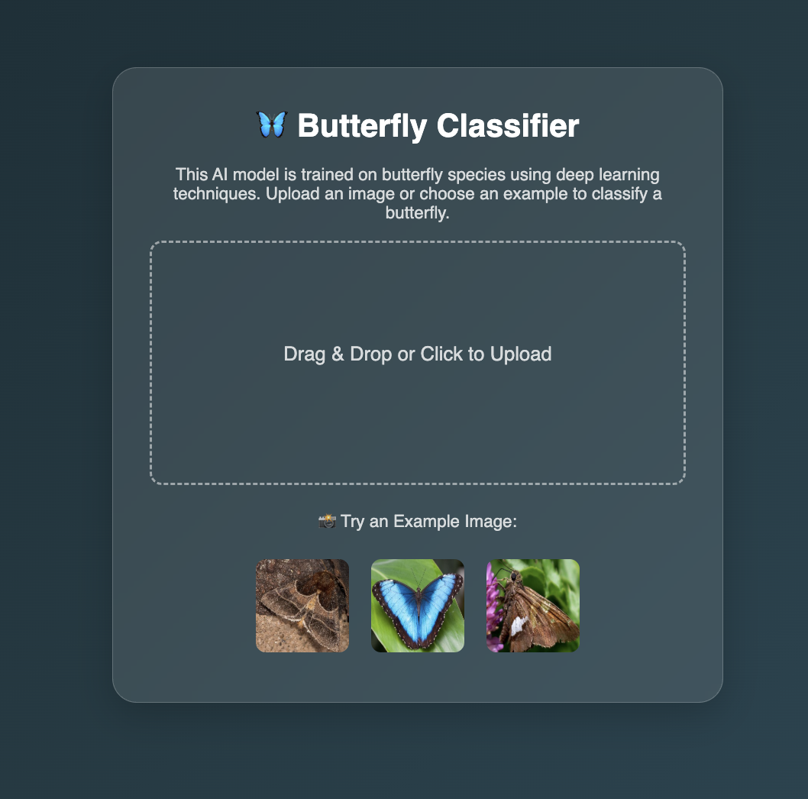
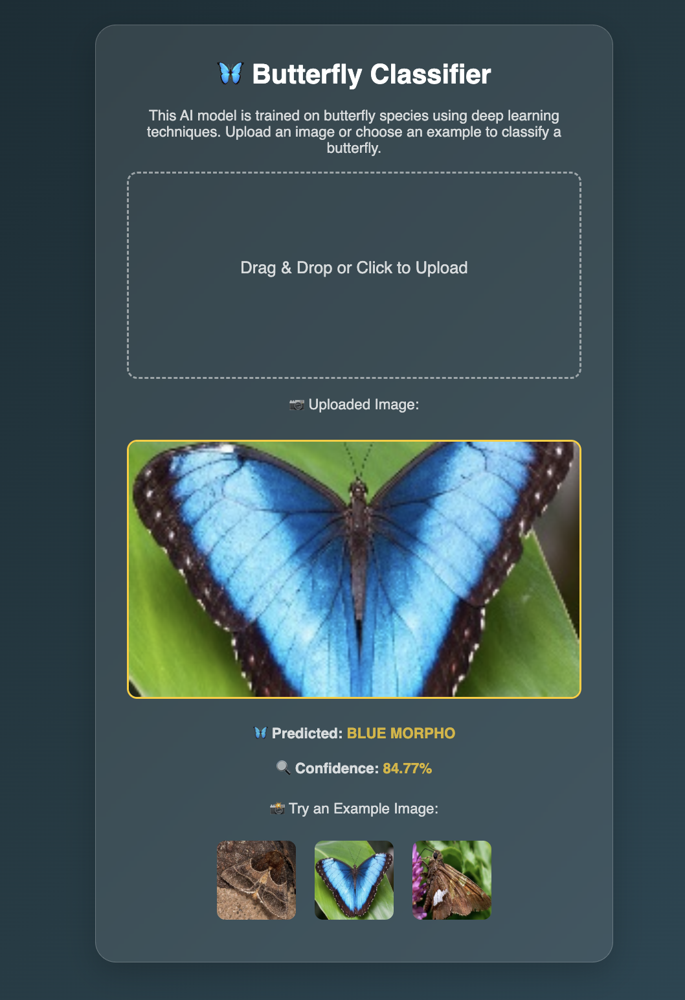

# 🦋 Butterfly Classifier – Google Cloud Flask App

This repository provides a **Flask-based web application** for serving trained image classification models on **Google Cloud Run**.  
It includes both **Keras (TensorFlow)** and **PyTorch** versions of the app.  

## 🎯 Aim of the Project

The goal of this code is to demonstrate how to deploy a trained deep learning model as a **user-friendly web app**.  
Users can upload butterfly images (or select example ones) to classify them into species.  

The provided web interface (`index.html`) supports drag-and-drop uploads and displays the predicted class with confidence.  

## 🗂 Project Structure
```
Google_Cloud_Demo_App/
├── app.py # Flask app (Keras version, uses model.h5)
├── app_pytorch.py # Flask app (PyTorch version, uses model.pth)
├── requirements.txt # Dependencies
├── class_names.txt # Class labels (one per line)
├── model.h5 # Example trained Keras model
├── model.pth # Example trained PyTorch model
├── templates/
│  └── index.html # Frontend web page
└── static/
   └── Example_Images/ # Example butterfly images
```
## 🖥️ How to Run Locally

1. Clone this repository:
   ```bash
   git clone https://github.com/basakesin/InsectAI-WG3-STSM.git
   cd InsectAI-WG3-STSM/Google_Cloud_Demo_App
2. Install dependencies:
   ```bash
    pip install -r requirements.txt

3. Run the app:
   ```bash
   python app.py

4. Open in browser:
   ```cpp
   http://127.0.0.1:8080

## 🌐 Deploying on Google Cloud Run

Before deploying, make sure you have:

1. A **Google Cloud account** → [Sign up here](https://cloud.google.com/)  
2. A **Google Cloud project** (you can create one in the [Google Cloud Console](https://console.cloud.google.com/))  
3. **Billing enabled** on your project (required for Cloud Run, though there is a free tier).  
4. **Google Cloud SDK (gcloud)** installed on your computer → [Install instructions](https://cloud.google.com/sdk/docs/install)  

Step 1: Authenticate Google Cloud:
  ```bash
  gcloud auth login
```

Step 2: Set your project:

  ```bash
  gcloud config set project PROJECT-ID
```

Step 3: Build the Docker image:

  ```bash
  gcloud builds submit --tag gcr.io/PROJECT-ID/butterfly-classifier
```

Step 4: Deploy to Cloud Run
  ```bash
  gcloud run deploy butterfly-classifier \
    --image gcr.io/PROJECT-ID/butterfly-classifier \
    --platform managed \
    --region us-central1 \
    --allow-unauthenticated
```
After deployment, Cloud Run will print a service URL. Open it in your browser to use the app.

## 📸 Screenshots

### Homepage


### Result Page



💡 **Tip:**  
You can customize the look and feel of the web app by editing `index.html`.  
- Change the `<h1>` and `<p>` tags to update the title and description.  
- Modify styles (colors, fonts, layout) in the `<style>` section.  

If you prefer, you can also provide your desired style or design as a **prompt** to GPT models (e.g., ChatGPT) and automatically generate updated HTML/CSS code for `index.html`. This makes it easy to experiment with different designs without manually editing all CSS.


