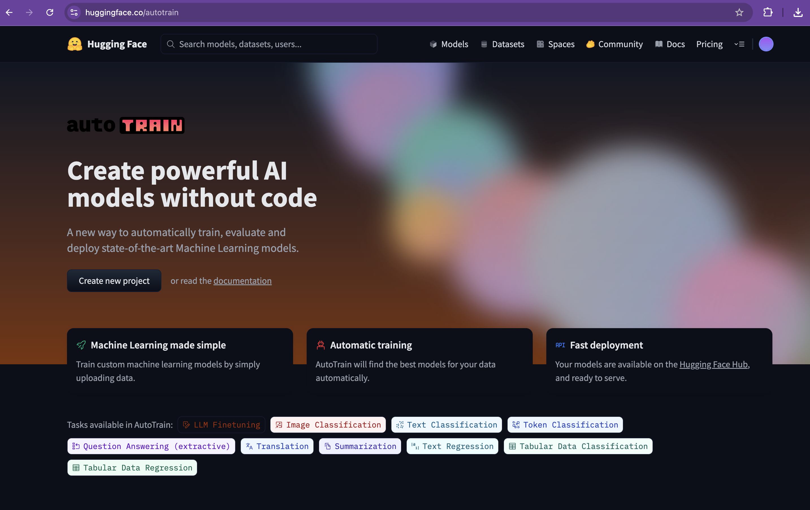
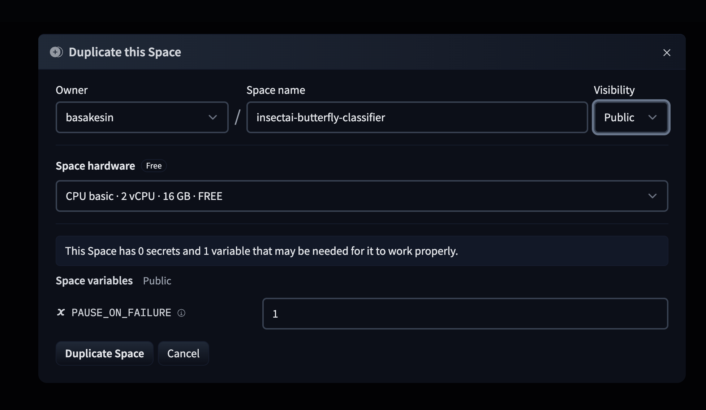
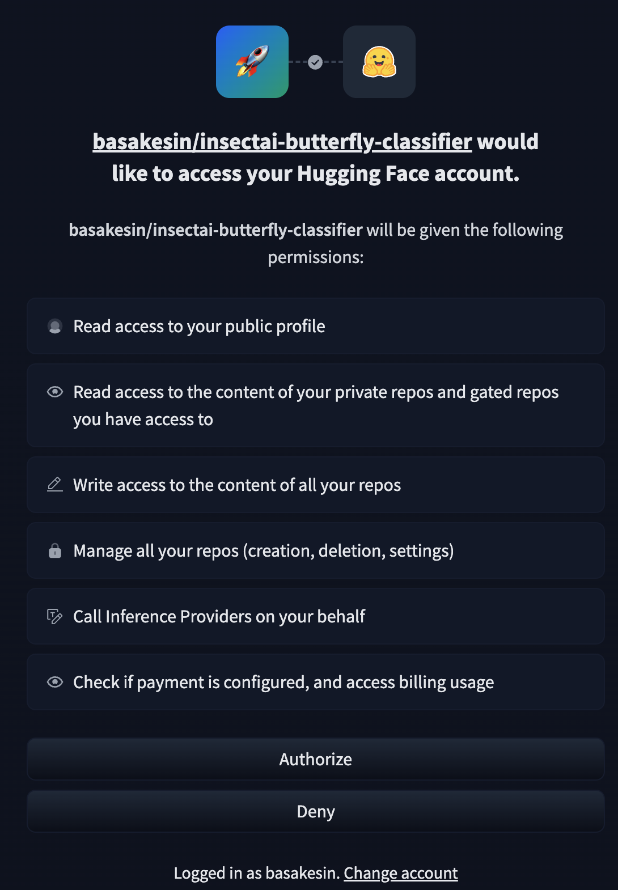
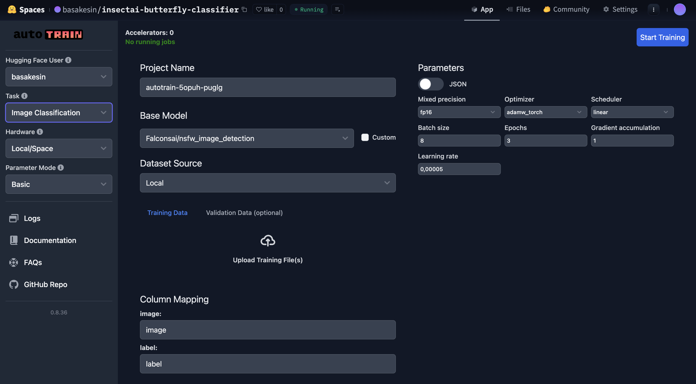
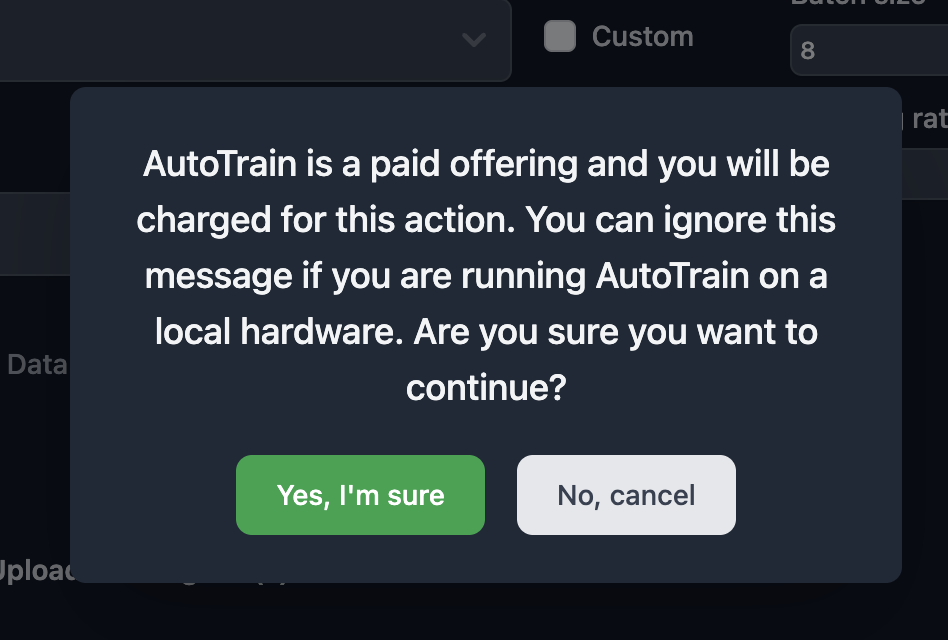
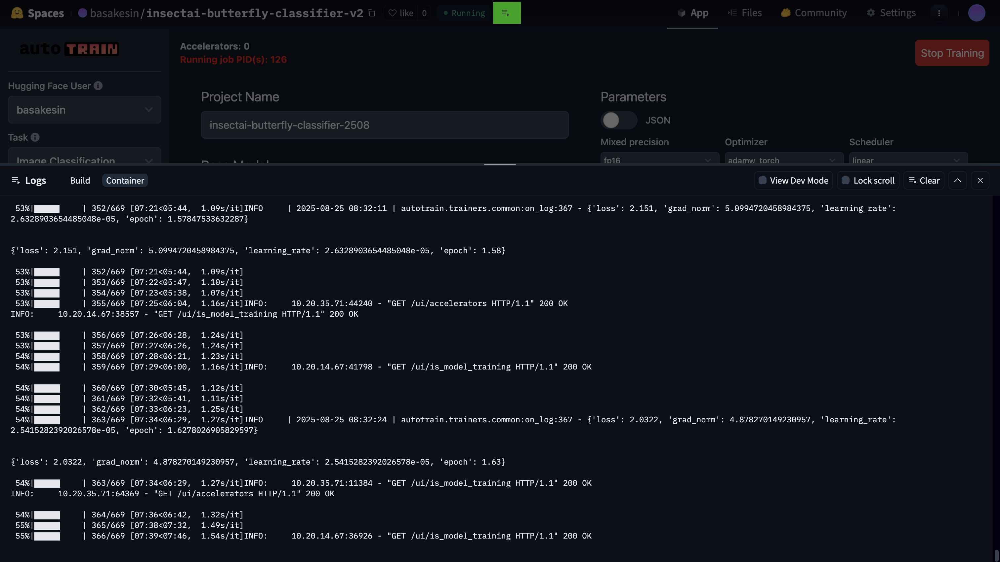
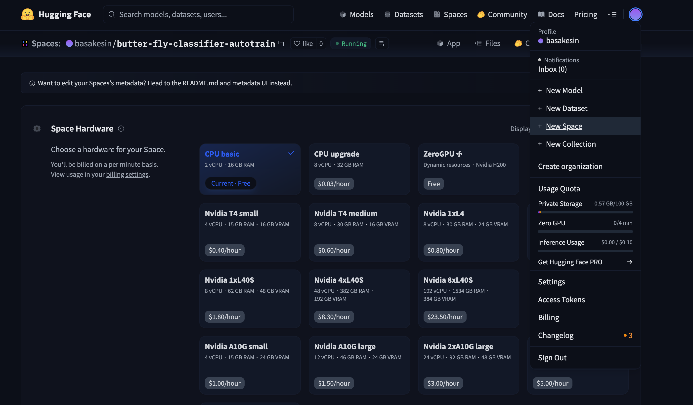

### 📌 Path 2: Use Hugging Face AutoTrain  

[AutoTrain](https://huggingface.co/autotrain) lets you train models via a **web UI** without coding.  

---

#### 1. Create a New AutoTrain Project  

- Go to [AutoTrain](https://huggingface.co/autotrain) and click **Create New Project**  
    

- Provide a clear and unique name for your project (e.g. `insectai-butterfly-classifier`).  
  - If set to **Private**, you must later add collaborators.  
  - If there are no restrictions, we recommend **Public** visibility.  
    

- Log in with your Hugging Face account and click **Authorize** to allow AutoTrain to manage repositories and run inference.  
    
    

- Select the task **Image Classification**.  
    

- You can rename the project (e.g. `autotrain-butterfly-demo`). This will also become the repository name on your profile.  

- Choose a **Base Model** (recommended: `microsoft/resnet50` or `google/efficientnet-b0`).  

- Upload your dataset (zipped folders).  
  ⚠️ Important: Zip the **class folders directly**, not the `train/` parent folder.  
  Your archive should look like:
  
classA/ image1.jpg, image2.jpg, ...
classB/ image1.jpg, image2.jpg, ...
classC/ image1.jpg, image2.jpg, ...

- Adjust training parameters (optional) and click **Start Training**.  

- You will see a warning that **AutoTrain Cloud is a paid service**.  
- If you use your own local hardware, it’s free.  
- Click **Yes, I'm sure** to continue.  
  

- You can track progress and logs by clicking the log icon next to the "Running" status.  
  

---

#### 2. Deploy AutoTrain Models on Hugging Face Spaces  

Once training is complete, the model is pushed to your Hugging Face account.  
You can deploy it on **Spaces** to create a shareable web demo.  

Steps:  

1. On Hugging Face Hub, click your profile picture → **+ New Space**  
   

2. Name your Space (e.g. `insectai-butterfly-classifier-demo`).  

3. Select **Gradio** as SDK.  

4. Choose **Public** (recommended) or **Private** visibility.  

5. In your new Space, open the **Files** tab → **+ Contribute → Create a new file**.  
 - Add [`app.py`](../Hugging_Face_Spaces_Demo/Hugging%20Face%20Spaces%20for%20Autotrain/app.py)  
 - Add [`requirements.txt`](../Hugging_Face_Spaces_Demo/Hugging%20Face%20Spaces%20for%20Autotrain/requirements.txt)  

6. Once saved, your demo Space will automatically build and become accessible via a public URL.  

