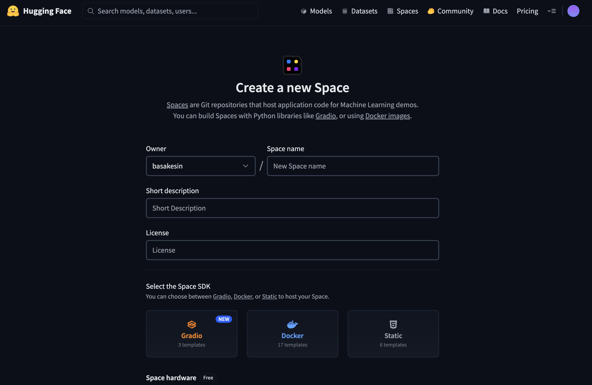
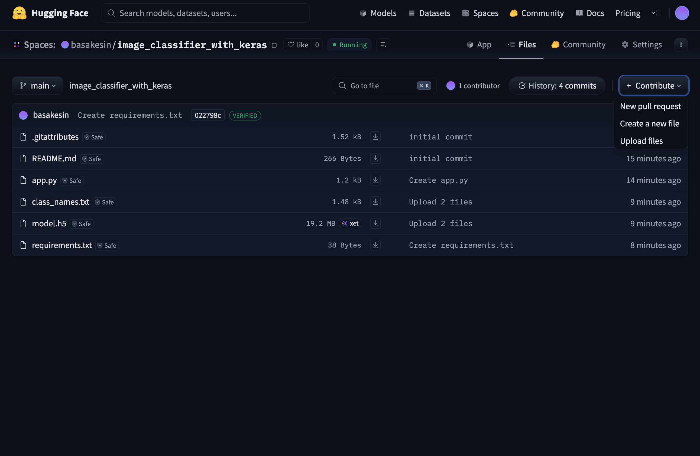

# 🦋 Butterfly Classifier (PyTorch + Gradio on Hugging Face Spaces)

This repository contains a **butterfly image classifier** trained with **PyTorch** and deployed on **Hugging Face Spaces** using **Gradio**.  
The model was trained on the [Kaggle Butterfly Image Classification dataset](https://www.kaggle.com/datasets/gpiosenka/butterfly-images40-species).

Upload a butterfly image and the app will return the **Top-3 predicted species** with probabilities.

## 🚀 Demo

👉 [Try the demo on Hugging Face Spaces](https://huggingface.co/spaces/YOUR_USERNAME/YOUR_REPO_NAME)  

## 🚀 Deploy on Hugging Face Spaces (No coding needed)

1. **Open your HF profile → New Space**  
   - On Hugging Face, click your avatar (top-right) → **Create new Space**.  
   - Give it a name, add a short description, pick a license (optional).

2. **Select the SDK**  
   - Choose **Gradio** as the Space SDK.  
   - Hardware: **CPU** is enough for this demo.

3. **Upload the project files**  
   - Go to the Space’s **Files** tab → **Upload files**.  
   - Upload these files from this repo:
     - `app.py`
     - `requirements.txt`
     - `model.pth` (your trained PyTorch model)
     - `class_names.txt` (one class name per line, in the same order used during training)

4. **Wait for the build**  
   - The Space will automatically build and switch to **Running**.  
   - You’ll see the Gradio interface with an **Upload Image** button.

5. **Test the app**  
   - Drop a butterfly image and check the JSON output for the **Top-3 Predictions**.

## ✏️ Customize the UI Text

You can change the app title, description, and labels by editing **`app.py`**:

- **Title** (appears at the top of the app)  
- **Description** (the explanatory text under the title)  
- **Input/Output labels** (e.g., “Upload Butterfly Image”, “Top 3 Predictions”)  

> After editing `app.py`, commit/push or re-upload it to your Space. The Space will rebuild automatically.

## 📁 What each file is

- **`model.pth`** — Your trained PyTorch model (saved with `torch.save(model.state_dict())`).  
- **`class_names.txt`** — Class labels used during training (one per line, in order).  
- **`app.py`** — The Gradio app that loads the model and serves predictions.  
- **`requirements.txt`** — Python dependencies for the Space.

## ❗️ Common pitfalls

- **Wrong class order:** Ensure `class_names.txt` matches the exact order of your model’s output classes.  
- **Architecture mismatch:** The architecture defined in `app.py` (e.g., ResNet50) must match the one used in training.  
- **Model loading error:** If `state_dict` keys don’t match, confirm you saved with `torch.save(model.state_dict(), "model.pth")` and not a full model.  
- **Build errors:** Check the **Logs** tab in your Space; missing packages usually mean updating `requirements.txt`.

 
